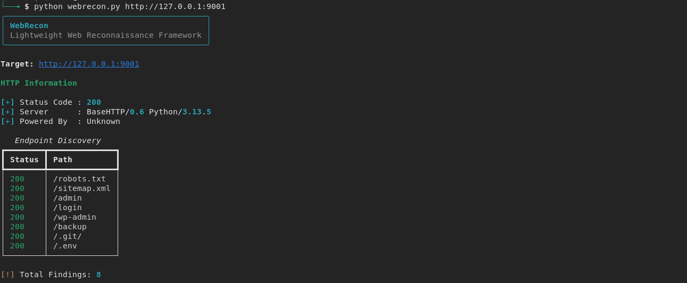
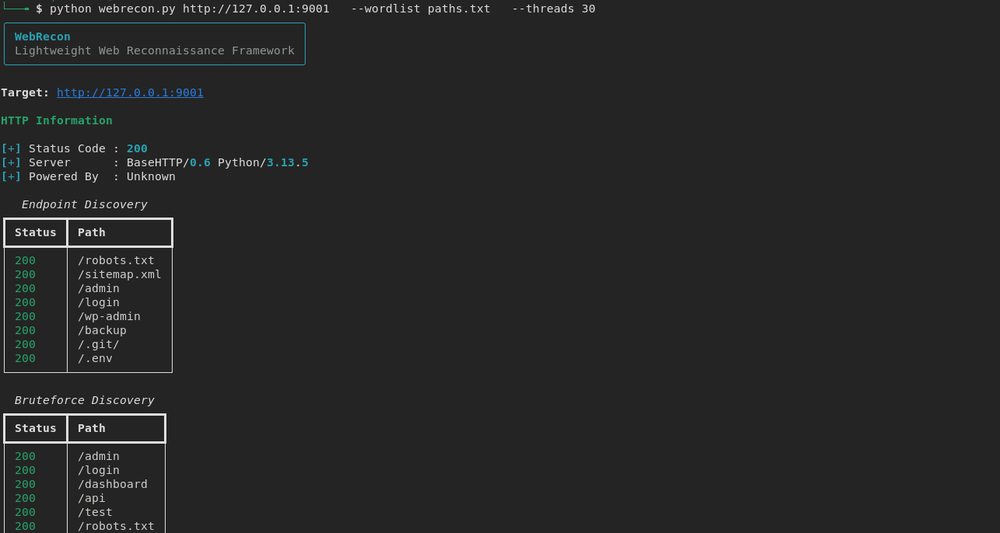

# WebRecon

WebRecon is a lightweight web reconnaissance tool focused on HTTP analysis, endpoint discovery, and basic content bruteforcing.

Designed for:
- learning
- CTFs
- lab environments
- security research practice

---

# Features

- HTTP header analysis
- Security header detection
- Common endpoint discovery
- Wordlist-based brute force scanning
- Threaded requests
- JSON report generation
- CLI interface

---

# Installation

```bash
git clone https://github.com/lslima123/webrecon.git

cd webrecon

python3 -m venv venv

source venv/bin/activate

pip install -r requirements.txt
```

---

# Usage

## Basic Scan

```bash
python webrecon.py http://127.0.0.1:9001
```

---

## Scan With Wordlist

```bash
python webrecon.py http://127.0.0.1:9001 --wordlist paths.txt
```

---

# Example Output

## Endpoint Discovery

- /robots.txt
- /sitemap.xml
- /admin
- /login

---

## Bruteforce Discovery

- /admin
- /dashboard
- /api

---

# Report Output

A JSON report is automatically generated:

```bash
report.json
```

Example:

```json
{
    "target": "http://127.0.0.1:9001",
    "results": {
        "headers": {},
        "discovery": [],
        "bruteforce": []
    }
}
```

---

# Screenshots

## Simple Scan



---

## Scan With Wordlist



---

# Disclaimer

This tool is intended for:
- educational purposes
- authorized security testing
- lab environments

Do not use against systems without permission.
